# Logbook — Architecture



A system that continuously reads Oracle alert/listener/dataguard logs from
Elasticsearch, distills what actually happened on each database, and maintains
that knowledge as an LLM-curated markdown wiki — Karpathy's llm-wiki pattern
(raw sources / wiki / schema), adapted for a continuous, high-volume,
highly-repetitive log stream instead of a static pile of articles.

## The one big adaptation

Karpathy's design assumes the LLM reads each source document directly. That
does not survive contact with database logs: ~1M docs in the local ES already,
and 99% of it is repetitive noise (`Archived Log entry NNNN added...`,
listener `establish * cdb1.world * 0` heartbeats). Letting an LLM paginate
raw ES hits would be slow, expensive, and would drown the signal.

So the core architectural decision is a **deterministic compaction layer
between Elasticsearch and the LLM**. Plain Python, no LLM: it turns a
(database × time-window) slice of raw logs into a small structured *digest* —
counts for the routine stuff, verbatim text for the notable stuff. The LLM
only ever reads digests, and only decides *what the digest means* and *what
in the wiki should change*. Cheap, deterministic bookkeeping below; judgment,
narrative, and cross-referencing above.

## Layers

```
┌────────────────────────────────────────────────────────────┐
│ 4. Consumers        agent Q&A sessions · lint agent        │
│                     · Obsidian graph view · emailed        │
│                     reports (later)                        │
├────────────────────────────────────────────────────────────┤
│ 3. Wiki (git repo)  entity pages · journals · incidents    │
│                     · error-class pages · reports          │
│                     · index.md/log.md                      │
├────────────────────────────────────────────────────────────┤
│ 2. Agents           pluggable LLM harness (codex CLI       │
│                     first; claude/ollama/pi adapters):     │
│                     ingestion: digest → wiki edits         │
│                     reporter: wiki deltas → fleet report   │
├────────────────────────────────────────────────────────────┤
│ 1. Compactor        Python: ES query → dedupe/cluster →    │
│                     classify → digest JSON+MD, watermarks  │
├────────────────────────────────────────────────────────────┤
│ 0. Raw sources      Elasticsearch (immutable truth):       │
│                     oracle-logs-{alert,listener,dataguard} │
│                     logs-oracle.* data streams, metrics    │
└────────────────────────────────────────────────────────────┘
```

### 0. Raw sources — Elasticsearch

What's there today (local docker-elk, `elastic:changeme`):

- `oracle-logs-alert-*`, `oracle-logs-listener-*`, `oracle-logs-dataguard-*`
  — daily indices, Aug 2025 → today, ~1M docs, two real DBs (`cdb1` primary +
  `cdb1_stby`, a Data Guard pair on lab-dg1/dg2). Nicely parsed already:
  `oracle.alert_message`, `oracle.msg_level`, `oracle.con_id`, `listener.*`
  (service, client program/host/ip, operation, return code), `db_name`,
  full `host.*` metadata.
- `.ds-logs-oracle.{alert,listener,metrics,synthetic}-default-*` — newer
  data-stream pipeline; the design treats index patterns as config so both
  generations work.
- `oracle-fleet-state` — synthetic fleet snapshots (tablespace %, FRA %,
  role, session utilization). Not a log stream; a future digest input.

ES stays the immutable source of truth and the drill-down target. The wiki
never replaces it — it points back into it.

### 1. Compactor (deterministic Python)

Runs per (database, source-type, time-window) — default window: one day,
also runnable ad-hoc for any range. Steps:

1. **Pull** the window from ES (scroll/search_after), driven by a config of
   index patterns + field mappings.
2. **Classify** each event against a pattern library (regex/startswith rules,
   versioned in the repo):
   - *lifecycle*: startup/shutdown, mount/open, parameter changes
     (`ALTER SYSTEM`), redo log switches/additions, tablespace DDL
   - *dataguard*: role transitions, MRP start/stop, gap detected/resolved,
     `RFS`/`LNS` errors
   - *errors*: any `ORA-\d+`, `TNS-\d+`, deadlocks, checkpoint incomplete,
     process crashes (msg_level, incident files)
   - *routine*: archived-log entries, successful listener establishes, etc.
3. **Compact**: routine classes → counters and rates (listener: connection
   counts by service/program/client-host, error return codes only);
   notable classes → kept verbatim with timestamp + ES doc `_id`.
4. **Detect deltas** vs. the previous digest: new services registered, new
   client programs, first-ever ORA codes, rate anomalies (connections 10×
   baseline), silence (a DB that stopped logging is itself an event).
5. **Emit** `digests/<db>/<date>.json` + a human-readable `.md` twin, and
   advance a per-(index,db) watermark (small state file or an ES index) so
   ingestion is incremental and idempotent — re-running a window overwrites
   its digest deterministically.

A digest for a boring day is ~30 lines. A digest for an interesting day is
maybe 200. That's what the LLM reads.

### 2a. Agent harness (pluggable from day one)

Both LLM stages (ingestion, reporter) run through one thin contract, so the
provider is a config choice, not an architecture choice:

> The harness is invoked with (task, digest path(s), wiki repo checkout) and
> must exit having (a) made its wiki edits and (b) written a result JSON:
> `{pages_touched, incidents_opened/updated, notable: bool, summary}`.
> The orchestrator (plain Python) validates the result, runs the wiki lint
> checks, and does the git commit — the agent never touches git itself.
> A validation failure (or a missing/unparsable result JSON) gets one
> feedback retry before rollback — `agents.feedback_retries` (default 0):
> same prompt, problem list appended, prior edits left in place to fix
> rather than redo.

Adapters, in build order:

1. **`codex exec`** — first target. Reads `AGENTS.md` natively; full agentic
   file access inside the wiki checkout.
2. **`claude -p` / Agent SDK** — same contract, same schema files.
3. **Ollama (local)** — a weaker model can't be trusted to roam the repo, so
   this adapter runs a constrained loop instead: digest + relevant pages in →
   structured list of proposed edits out → applied by deterministic code.
   The result JSON is identical, so downstream stages don't care.
   Implemented as `agents.mode: structured` (`src/dbwiki/structured.py`) for
   ingest and for **routine** fleet reports; a report on a window with a
   notable item stays agentic by default, because its historical-context step
   is the report's whole value — `agents.escalated_report: structured` opts
   it into the structured path too (see 2c).

Consequence for the schema layer: **`AGENTS.md` is canonical** (codex reads
it natively); `CLAUDE.md` just points at it. All page templates and rules
live in files both harnesses read the same way.

### 2b. Ingestion agent

One harness run per new digest (or batch of digests), governed by the schema
layer. Its job, in order:

1. Read the digest + the affected DB's profile and open incidents.
2. **Judge novelty**: routine day → one journal line, done. Notable events →
   decide: does this extend an open incident, open a new one, or change a
   standing fact (role transition ⇒ update both DB profiles)?
3. **Write**: journal entry (always), incident pages (as needed), entity-page
   updates (DB profile, host, error-class pages like `errors/ORA-00600.md`
   which accumulate occurrences *across* databases), `index.md`, `log.md`.
4. **Cite**: every claim carries provenance — digest link + ES index/time
   range/doc ids, so any wiki statement is one query away from raw evidence.

Supervision dial (Karpathy's ingestion modes, kept): fully autonomous for
journal/routine updates; incidents can be flagged for human review before
being marked closed. Model policy: bulk ingestion on a cheap model, escalate
to a stronger model only when the digest contains incident-grade events —
"cheap" and "strong" are per-adapter config, not hardcoded model names.

### 2c. Reporter agent

Runs after ingestion whenever ingestion reported `notable: true`, and once a
day as a consolidation pass regardless. It does **not** read raw logs or
digests directly — it reads what ingestion just wrote (journal entries,
incident pages touched in the window) plus their backlinks (error-class
pages, DB profiles, past incidents), which is where historical context comes
from: "cdb1 threw ORA-01555 tonight; last seen 2026-03-14, fixed then by
increasing undo_retention."

Output: **one fleet-wide report per run** — `reports/YYYY-MM-DD[-HHMM].md`.
Notable databases get a narrated section with wiki links and ES provenance;
quiet databases get one line. The report is a wiki page like any other:
committed, linked from `index.md`, listed in `log.md`.

Delivery: git push, plus a deterministic per-day HTML summary for DBAs
(`html/<day>.html` + `html/index.html`, `src/dbwiki/daily_html.py`): tiered
needs-attention / worth-a-look / routine entries linking into the wiki,
re-rendered and committed on every run tick. Email is deliberately deferred — a later
delivery step reads recipient config and sends the same markdown; nothing
upstream changes.

Naming rule used throughout this doc: a **digest** is compactor output
(machine-facing, layer 1); a **report** is reporter output (human-facing,
layer 3). The two are never the same artifact.

`agents.escalated_report: structured` (default `agentic`) is an opt-in for
the case above where escalation and structured mode collide: instead of
falling back to the agentic adapter, the strong `pi` tier gets a
deterministically assembled "Material" context pack — each notable
database's digest excerpt, the latest same-day prior report, open incidents,
and the error-class pages its codes touch (`structured.
build_escalated_report_prompt`) — standing in for the historical-context step
an agent would do by reading the wiki. The model returns one extra field,
`notable_analysis`, which the deterministic writer renders as a `## Notable
items` section; it may only cite pages that appear verbatim in the Material,
and anything else is flattened like any other model prose.

### 2d. Researcher agent

Runs on its own schedule (weekly cron, never part of the `run` tick): looks
up external cause/fix knowledge for error-class pages so a human reviewing an
incident later finds the background already attached. Deterministic Python
picks the workload — error pages with no `researched:` frontmatter or whose
research went stale (a cited source was re-reviewed, deprecated, or removed),
pages linked from open incidents first — and the web-enabled agent
(`research.adapter` / `research.model` override; `pi` + local
`lfm2.5-2.6b` in practice, with `research.model` unset so it falls through
to the `agents.pi` tiers) writes a cited `## Reference` section only. Under
today's `research.mode: structured` this agentic path is reached only by
source-page review; see below. External claims never leak into
Occurrences or Resolution history, and are never phrased as observed facts.

Citations are gated by a **source catalog**: `wiki/sources/<slug>.md` pages
with frontmatter `status`, `tier`, `domains`, `fetchable`, `last_reviewed`,
`review_after_days`. A URL may be cited only if its host is (a subdomain of)
a domain on an `approved` source page; the orchestrator validates the
post-run tree and rolls back on any violation, including the agent creating
a source page — new sources are proposed in the result-JSON `flags` and
added by a human. Sources past their review interval are folded into the
research run; `dbwiki research --sources-only --review-sources` re-reviews
the whole catalog (monthly cron). Deprecating a source automatically makes
every page citing it stale, so it gets re-researched.

`research.mode: structured` is the same local-model fallback as `agents.mode:
structured`, applied to error-page lookups: no web-capable agent runs at
all. Deterministic code (`src/dbwiki/research_structured.py`) picks the one
approved+`fetchable: true` source with `docs.oracle.com` among its domains,
builds each page's Oracle error-help URL itself (`docs_url`), fetches it
(`requests` + a stdlib `html.parser` text extractor), and hands the fetched
text to a cheap one-shot `pi` text call — the model only returns
`{"cause", "action"}` JSON, distilled from the text it was given, never a URL
or a citation judgment. `apply_research` writes the `researched:` date and
the `## Reference` section exactly like the agentic path would, so the same
`unapproved_urls`/provenance rails apply unchanged. A page whose fetch fails
is flagged and left untouched rather than failing the run. Each page is its
own transaction and its own commit, `research — structured research:
errors/<CODE>.md`, carrying that page's `log.md` line: a run killed at page 40
of 45 leaves 39 commits and a clean working tree instead of 40 uncommitted
pages for `dbwiki health` to refuse every later stage over. A page the lint
blocks is restored to its own base and flagged like an unfetchable one; only
a base that moved or a tree that went dirty under the lock still stops the
run. Source-page review
(`--review-sources`) always stays agentic — judging whether a live site went
stale needs a browse structured mode has none of, so any review workload
takes the whole call agentic, same as report falling back to agentic for a
notable window.

### 3. Wiki layer (git repo of markdown)

```
wiki/
  index.md                      # catalog: every page, one-liner, links
  log.md                        # append-only: [date] ingest|incident|lint | ...
  databases/
    cdb1.md                     # profile: version, role, host, services,
                                #   params, DG partner, open incidents, links
    cdb1/journal/2026-07.md     # monthly journal, one dated entry per digest
  hosts/lab-dg1.md
  services/cdb1.world.md        # listener service: who connects, from where
  incidents/
    2026-07-06-cdb1-arch-gap.md # timeline, evidence links, diagnosis, status
  errors/
    ORA-00600.md                # error-class page: every occurrence, contexts,
    ORA-01555.md                #   what fixed it last time — the memory that
                                #   makes incident #2 cheaper than incident #1
  concepts/
    dataguard-cdb1-pair.md      # topology, expected lag, failover history
  reports/
    2026-07-11.md               # fleet report (reporter agent output)
  sql/                          # future: per-sql_id pages (see Extensions)
  digests/<db>/<date>.{json,md} # compactor output = the wiki's "raw sources"
  html/<date>.html              # daily DBA summary (machine output, like digests/)
```

Conventions: YAML frontmatter (`db`, `host`, `tags`, `date_range`, `status`
for incidents), `[[wikilinks]]` between pages, ES provenance blocks. Git
history *is* the audit trail; Obsidian optional for graph view.

### Schema layer

`AGENTS.md` in the wiki repo (canonical — codex-native; `CLAUDE.md` points at
it) defines: page templates, frontmatter contract, what is incident-worthy vs
journal-worthy vs report-worthy, citation format, and the four workflows
(ingest / report / query / lint) — plus a small CLI the agent may call:

- `dbwiki compact --db cdb1 --from ... --to ...` — run the compactor
- `dbwiki es <query-template> [params]` — parameterized ES drill-down
  (so query sessions can go below the wiki when detail is missing)

### 4. Consumers

- **Q&A**: open an agent session (codex / Claude Code) in the wiki repo, ask
  "what happened to cdb1 in early July?" or "have we seen this ORA-600
  before?" — agent reads index.md, relevant pages, drills into ES only if
  needed, and files good answers back as pages (Karpathy's
  compounding-knowledge move, kept verbatim).
- **Lint agent** (weekly cron): contradictions (profile says PRIMARY, latest
  digest says standby), stale profiles, orphan pages, open incidents with no
  activity for N days, digest gaps (missing days), broken links.
- **Reports**: the fleet reports from 2c, plus monthly per-DB roll-ups
  generated from journals and filed back into the wiki. Email delivery of
  reports plugs in here later, driven by config.

## Scheduling (adaptive)

The shape of the idea is below; the concrete schedule, the wake/skip reason
codes and the per-stage model routing live in `docs/scheduling.md`.

The expensive thing (LLM) only runs when the cheap thing (compactor) finds
something worth reading:

```
cron (~2h, per DB)  → compactor → digest
                        ├─ notable events → ingestion agent
                        │     └─ reporter agent → fleet report → git push
                        └─ routine only   → digest saved, no LLM run
cron (daily)        → consolidation: ingest accumulated routine digests
                      (journal lines) → daily fleet report → git push
cron (weekly)       → lint agent → issues filed into log.md / flagged
ad-hoc              → Q&A sessions, backfill runs (compactor over history)
```

"Notable" is decided deterministically by the compactor (any event outside
the routine classes, any delta from step 4) — the LLM is never woken up just
to conclude a window was boring.

Backfill is the first real test: run the compactor over Aug 2025 → today,
ingest chronologically, and the wiki bootstraps itself with 11 months of
cdb1/cdb1_stby history — including whatever incidents are hiding in there.

## Extensions (designed-for, not built first)

- **Performance / sql_id pages**: same pattern, new source. Feed AWR/ASH or
  `logs-oracle.metrics` through a compactor profile that aggregates per
  sql_id (wait-event distribution, plan_hash_value changes, elapsed-time
  regressions) → `sql/<sql_id>.md` pages tying plan flips to dates, linkable
  from incident pages ("slowdown correlates with plan change on sql_id X").
- **More sources**: fleet-state snapshots, OS logs, Grid/ASM alert logs —
  each is just a new compactor profile + pattern set.
- **Scale**: at a fleet of hundreds of DBs, index.md stops being enough for
  navigation → add local search (qmd-style BM25/hybrid) over the wiki. The
  page structure doesn't change.

## Build order

1. **Compactor MVP** — alert-log patterns for cdb1, one-day digest, watermark,
   deterministic notable/routine verdict.
2. **Wiki skeleton + schema** — repo layout, templates, AGENTS.md workflows.
3. **Ingestion agent on codex** — harness contract + `codex exec` adapter:
   digest → journal + profile updates + result JSON.
4. **Reporter agent** — wiki deltas → fleet report, committed + pushed.
5. **Backfill** the 11 months of real data; iterate on patterns/templates
   against what actually surfaces.
6. **Incidents + error-class pages**, then lint agent, then listener/DG
   compactor profiles, then the claude/ollama adapters, then Q&A polish.
   Email delivery of reports lands here too, once the content is proven.
