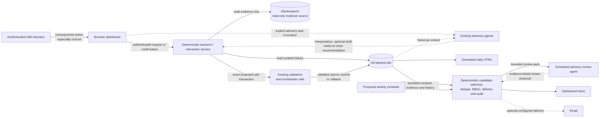

# Incident remediation workflow and dashboard concept

Status: design notes, kept for provenance. The decisions that stuck are in
`docs/adr/0003-incident-lifecycle-and-action-records.md`; read that first.

Last updated: 2026-08-30

Revised 2026-08-30. The defect section states the drift the code actually
has. Questions 1, 2, 4, 5, 6 and 8 record decisions now taken.

This document captures the current discussion about how Logbook should
turn observed evidence, DBA actions, monitoring, and human closure decisions
into durable operational knowledge. It is intentionally not an accepted ADR
or an implementation specification yet. It will be updated as the session
continues.

## Purpose

The project already detects and explains notable database-log windows well,
but it does not yet provide a clean operator workflow for recording what a DBA
did and deciding when an incident is finished. The intended result is a
controlled interaction layer over the existing Git-backed wiki, without
weakening its provenance, validation, or audit properties.

The sections below deliberately separate:

- verified current behavior;
- discovered defects;
- proposed product decisions;
- open questions.

## Verified current behavior

### Data and artifact boundaries

- Raw Oracle alert, listener, and Data Guard logs remain in Elasticsearch.
  Upstream log shipping is a separate system; this repository reads the feed
  and detects when it stops, but does not own the collector
  (`README.md`, lines 3-5 and 59-61).
- Deterministic compaction converts a database and time window into a bounded
  JSON and Markdown digest. Routine events become counters, notable events are
  collapsed into groups, and historical deltas are calculated before any
  model is invoked (`src/dbwiki/compactor.py`, lines 1-10).
- Compacted evidence, database journals, incidents, error histories, fleet
  reports, and generated daily HTML live in the separate Git-backed `wiki/`
  repository (`README.md`, lines 16-19; `wiki/AGENTS.md`, lines 13-27).
- `digests/` and `html/` are machinery-owned output. They are excluded from
  agent edits and lint, survive rollback, and are regenerated by their owning
  processes (`src/dbwiki/orchestrate.py`, lines 24-28 and 222-246).

### Processing loops

The system is easier to reason about as four related but distinct loops:

1. **Compaction and gating:** deterministic code discovers databases, compacts
   the day-so-far evidence, then decides `wake`, `skip`, or
   `force_consolidation`. Unchanged and routine-only windows normally skip the
   model (`docs/scheduling.md`, lines 61-85; `src/dbwiki/trigger.py`).
2. **Database interpretation:** a selected digest becomes a proposal for
   journal, incident, error-history, and related curated-page changes. In the
   current structured path, the model proposes and deterministic code chooses
   paths and writes files (`src/dbwiki/structured.py`, `apply_proposal`).
3. **Fleet reporting:** reporting is a separate synthesis step across ingested
   databases and existing history. It runs for notable windows and at daily
   consolidation (`docs/scheduling.md`, lines 75-80).
4. **Validation and publishing:** proposed changes are checked against result
   contracts, path rules, and provenance lint, then atomically committed and
   optionally pushed; failure rolls the agent-owned changes back
   (`src/dbwiki/orchestrate.py`, lines 517-570).

These loops should remain distinct in both implementation and user-facing
language. In particular, a plausible interpretation is not the same thing as
validated publication, and a fleet report is not the source evidence.

### What “learning” means here

The model is not retrained by this system. “Learning” means that selected
knowledge is written to durable Git history and used during later historical
comparison: journals record windows, incidents accumulate timelines, and
error pages retain prior occurrences and confirmed fixes. A later report can
therefore answer “have we seen this before, and what fixed it?” without any
model-weight update (`wiki/AGENTS.md`, lines 17-21 and 98-102).

Selection is intentional. Routine raw lines are not copied into the wiki;
they remain available in Elasticsearch and are represented by counters in a
digest. This reduces noise and cost, but it also means the wiki is a curated
memory, not a lossless replacement for Elasticsearch.

Validation checks structure and provenance boundaries. It can establish that
a cited digest exists, that links resolve, and that an agent stayed within its
allowed paths. It does **not** prove that prose is semantically true, that a
suggested cause is the actual cause, or that one event caused another
(`docs/provenance.md`, lines 16-45 and 158-176).

### Actions, intent, and recovery evidence

An operational action can sometimes be observed in a log—for example, a
broker command or database state transition. Logs usually do not establish
the operator's intent, change-ticket context, expected outcome, or judgment
that the remediation succeeded. Those normally require a human-authored note.

There is currently no dedicated UI or CLI command to record a remediation or
close an incident:

- A user edits curated incident and error Markdown directly in the wiki and
  commits it like any other Git change. The incident holds the dated action,
  outcome, and recovery evidence; the error page's `## Resolution history`
  holds the confirmed reusable fix (`wiki/AGENTS.md`, lines 20-21 and 41-45).
- `.state/recovery_annotation.txt` is a separate, narrow input to
  `dbwiki health`. It labels pipeline recovery evidence as an
  `operator_annotation`; it does not edit the wiki or close an incident
  (`src/dbwiki/health.py`, lines 471-479).
- Curated human changes must be committed or stashed before an agent-backed
  run. The clean-tree guard refuses to proceed over uncommitted curated edits
  because rollback could otherwise erase them (`src/dbwiki/orchestrate.py`,
  lines 320-332).
- Structured ingest opens or extends incidents but explicitly never closes
  them (`src/dbwiki/structured.py`, lines 935-969).

### Manual-edit and overwrite boundaries

Unique operator notes belong on curated incident and error pages, committed
before the next agent-backed run. They should not be placed in generated
surfaces:

| Surface | Current ownership and overwrite behavior |
|---|---|
| `wiki/digests/` | Compactor output; regenerated; never hand-edit. |
| `wiki/html/` | Daily renderer output; regenerated every tick; never hand-edit. |
| `wiki/reports/<day>.md` | Reporter output; a later same-day or analyst report can supersede it. Git retains the prior version. |
| Current day's structured journal block | Replaced by the latest cumulative same-day ingest; not suitable for a unique operator note. |
| Incident pages | Curated history. Structured ingest appends/replaces its own dated update section and never closes the incident; separately committed human sections are normally preserved. |
| Error pages | Curated history. Structured ingest updates occurrence rows; a separate `## Resolution history` is the durable place for a confirmed fix. |

Agentic stages have broader page-edit authority than the structured writer,
so Git history remains the final audit and recovery mechanism for curated
content.

## Discovered defects

### Incident status readers disagree with each other

An earlier revision of this section stated the defect backwards. This is the
corrected reading. The canonical wiki schema is right. `wiki/AGENTS.md`,
line 55, documents `status: open|monitoring|resolved`, and all 25 live
incident pages carry `status: open`. There is no vocabulary to change in the
schema and no page to migrate.

The drift is in the code. Four readers decide whether an incident is still
active, and between them they apply three different rules:

| Reader | Rule | A `monitoring` incident |
|---|---|---|
| `structured._unresolved` (`src/dbwiki/structured.py`, lines 75-87) | active unless the literal `resolved` | active |
| `daily_html.open_incidents` (`src/dbwiki/daily_html.py`, lines 106-127) | delegates to `structured.all_open_incidents` | active |
| `research._open_incident_codes` (`src/dbwiki/research.py`, lines 119-127) | active only on the literal `open` | dropped |
| `research_offload._incident_state` (`src/dbwiki/research_offload.py`, lines 119-130) | `resolved` counts resolved, `open` and `monitoring` count open | open |

Consequences:

- an incident moved to `monitoring`, the state this whole workflow is built
  around, drops out of the research candidate set, so its linked error codes
  stop being scheduled for research;
- `research_offload` counts any fourth value as neither open nor resolved, so
  the offload request for that error code reports fewer incidents than exist
  and nothing reports the gap;
- a typo fails open and stays silent. A missing `status` reads as `unknown`
  and a misspelled one stays as written, and `_unresolved` keeps both in the
  active list. `lint.RULES` (`src/dbwiki/lint.py`, lines 29-45) holds six
  rules, none of which looks at incident status, so a page saved as
  `status: opne` publishes clean and is then active in one reader, inactive
  in another, and neither in a third;
- daily HTML badges every unresolved incident “Open incident” whatever its
  status says (`src/dbwiki/daily_html.py`, line 508), so the badge
  contradicts the `status:` text the next line prints beside it.

Two files carried the word `closed`, which matches no schema and no reader.
`docs/provenance.md`, line 164, described the deferred lint rule as judging a
transition into `closed`; this revision corrects it to `resolved`.
`tests/test_research.py`, line 135, built an incident fixture whose status
was the string `closed`; phase 0.2 fixed it along with the two other
fragile incident tests.

### The curated sections the schema promises do not exist

`wiki/AGENTS.md`, line 41, names a `## Resolution history` section on error
pages. It appears in 0 of 64 error pages, and no code path reads or writes
it. Outside the Stage 0 sketches, its only mention in `src/` is the ingest
prompt line forbidding external claims there (`src/dbwiki/orchestrate.py`,
line 1117).

`## Actions`, `## Timeline`, and `## Monitoring` appear nowhere in the wiki
and nowhere in the code. The de facto incident timeline is the run of
`## Update <day>` blocks the structured ingest writer maintains, 32 of them
across the live wiki. Those blocks are machine narration of observed
evidence. They record what the logs showed, never what a person intended,
did, or judged to have worked.

There is therefore no durable place for human intent today, and the place the
schema promises for a confirmed reusable fix has never been filled. These are
verified implementation defects, not product-design preferences.

## Proposed product decisions

The following decisions are proposals for discussion, not implemented facts.

### Product priority: human action and knowledge capture first

The initial UI should primarily help a DBA record what people did and preserve
what the organization learned. Its main job is not to visualize the pipeline,
repackage monitoring, or provide broad fleet analytics. It should make the
high-value human gaps in the current workflow easy and safe:

- select the incident being worked;
- record the remediation or other action taken;
- add operator notes, outcome, intent, and evidence references;
- start an explicit monitoring period; and
- confirm resolution when the DBA judges the evidence sufficient.

Automated evidence, historical context, and agent recommendations support
these tasks. They should be available at the point of decision without taking
over the main interaction or making the operator hunt through a generic
dashboard.

### Human-controlled incident lifecycle

Use this lifecycle:

1. **Open** — the condition is active or its state is unknown.
2. **Action recorded** — a DBA records what was done, why, when, by whom, and
   the expected recovery signal. This is an event in the incident history,
   never a frontmatter status (decided 2026-08-30).
3. **Monitoring** — the action is complete and the system is collecting
   recovery/stability evidence over an explicit observation window.
4. **Ready to close** — automation has found the required evidence and can
   explain why closure is recommended, including any contradictory evidence.
   This is a derived recommendation, not a stored status.
5. **Resolved** — a DBA confirms the decision, and `resolved` is the stored
   terminal value (decided 2026-08-30). The final record names the
   remediation, evidence window, residual risk, and decision identity.
6. **Merged** — a duplicate page for the same db and day is folded into the
   page that keeps the incident (built 2026-09-08). The duplicate ends
   `resolved` and points at the page that kept it; the kept page absorbs what
   the duplicate evidenced and holds its own status, which a merge never
   moves.

Automation should collect evidence, compare it with the expected recovery
signal, measure stability, and recommend moving to the next state. It must not
make the final closure decision. A DBA owns that decision because absence of
errors is not proof of recovery, causality is not mechanically established,
and operational context may exist outside the logs.

### Deterministic service, advisory agents

The proposed dashboard and thin backend are ordinary deterministic service
software, not another agent. They own:

- authentication and authorization;
- loading and parsing curated Markdown;
- enforcement of the incident state machine and allowed transitions;
- exact file and Markdown-diff generation for preview;
- validation and provenance lint;
- optimistic concurrency/base-commit checks;
- atomic Git commit or rollback; and
- authenticated identity and audit metadata.

Given the same authenticated request, repository revision, and evidence, this
service should produce the same proposed transaction or the same rejection.
No model may bypass these checks, write lifecycle state directly, or obtain a
privileged Git mutation path.

Existing agents remain upstream or downstream advisers. They may interpret
compact evidence, retrieve historical context from the wiki, draft a
remediation summary, and recommend that an incident is “ready to close.” Their
output is input to the deterministic service, never an authoritative state
transition. A human confirms consequential actions, especially closure.

### Action record as a first-class curated event

An action record should include at least:

- incident identifier;
- action timestamp and acting identity;
- human-authored intent and change/ticket reference;
- exact action or remediation summary;
- expected recovery signal and monitoring duration;
- optional links to observed log/digest evidence;
- outcome, follow-up notes, and rollback information.

The backend should render this into the canonical incident Markdown and, once
the fix is confirmed, update the affected error page's Resolution history.
The user should preview the exact Markdown diff before publication.

An agent may optionally draft the remediation summary. If used, the draft must
be explicitly labeled **Agent proposal**, link to the evidence it relied on,
and remain editable or rejectable by the DBA. A human-authored summary is a
fully supported path; model drafting must never be required to record an
action.

## Dashboard concept: a controlled interaction layer over Git

The dashboard is not a new source of truth. It is a safer, task-oriented way
to produce validated Git changes in the existing wiki.

### Core experience

- **Focused incident selector:** open and monitoring incidents with only the
  context needed to choose the right record; this is a work queue, not an
  analytics dashboard.
- **Record action:** structured form for intent, action, expected signal,
  monitoring duration, ticket, operator notes, outcome, and evidence links.
- **Start monitoring:** explicitly begins the observation window and records
  its criteria.
- **Confirm resolution:** a separately permissioned DBA action; never an agent
  side effect.
- **Supporting evidence and history:** incident timeline, prior actions,
  digests, error occurrences, related reports, recovery signals, and Git
  history remain close at hand but secondary to the action form.
- **Closure recommendation:** advisory analysis presents the evidence for and
  against closure, confidence limits, missing evidence, and the proposed next
  step. The deterministic service checks whether the state transition is
  allowed and generates the exact diff; it does not invent the recommendation.
- **Exact Markdown preview:** show the files and full diff that will be
  written, including incident, error Resolution history, index/log changes,
  and metadata.
- **Backend validation and lint:** run the existing contracts and provenance
  checks before accepting the change.
- **Atomic commit or rollback:** publish all related page edits as one commit,
  or leave the wiki unchanged.
- **Identity and audit:** record authenticated actor, time, reason, decision,
  validation result, and Git commit.
- **Recommendation/decision separation:** labels and audit records must make
  agent suggestions visually and structurally distinct from human decisions;
  any agent-drafted remediation text is labeled as a proposal with evidence
  links.

### Minimal MVP scope

The first useful release needs one narrow end-to-end transaction path:

1. select an existing incident;
2. record action taken, free-form operator notes, outcome, and optional
   evidence references;
3. start monitoring with an expected signal and observation window;
4. confirm resolution as an explicit human decision;
5. preview the exact Markdown/files before each write; and
6. validate, lint, concurrency-check, and atomically commit or roll back the
   resulting Git transaction with actor/audit metadata.

The MVP may show compact evidence and an optional agent proposal inside that
flow. It does not need generalized fleet dashboards, trend analytics, custom
charting, report exploration, or a new observability surface. Those features
are deferred unless evidence shows that they are necessary to complete the
human action-capture workflow.

### Proposed future direction: primary operational portal

After the focused incident workbench proves its workflow and safety model, the
same UI may grow into the primary operational portal for the whole project.
Normal DBA users would no longer need to navigate generated daily HTML,
Markdown files, or Git history directly for routine work. Git would remain the
durable system of record, transaction log, and audit/recovery mechanism behind
the portal—not be replaced by a second source of truth.

A coherent portal could offer these connected perspectives:

- **Fleet overview:** current attention state and a concise path into affected
  databases, without becoming a general metrics dashboard.
- **Databases:** standing context, recent activity, open/monitoring incidents,
  known errors, and links into historical evidence.
- **Incidents:** evidence, timeline, operator comments/notes, actions,
  monitoring criteria, recommendations, and closure decisions.
- **Daily activity and reports:** an optional chronological view that makes the
  existing daily summary and fleet reports navigable without exposing their
  generated files as the user interface.
- **Automation health / Workflow activity:** a simplified operational view of
  what the orchestrator and its deterministic/agent loops did, whether the
  result is fresh, and what needs attention.

Navigation should support a natural drill-down from fleet → database →
incident → evidence/history and let an authorized user add notes or comments,
record remediation, start or extend monitoring, and confirm closure without
handling files. Provenance must remain visible: hiding Git mechanics from the
normal workflow must not hide evidence links, commit identity, or revision
history.

This future direction does not reverse the MVP decision. It defines a staged
roadmap:

1. **Phase 1 — incident action workbench:** the narrow action/notes/monitoring/
   resolution transaction defined above.
2. **Phase 2 — unified read portal:** fleet, database, incident, optional
   daily/report perspectives, and basic workflow/run health with consistent
   search, navigation, provenance, and freshness indicators.
3. **Phase 3 — bounded advisory assistance:** small task-specific tools invoked
   by a user from the relevant context, plus an optional weekly attention-review
   loop with deterministic selection and delivery controls; add richer
   agent-loop drilldowns only after the underlying event contract is stable.

Each phase should earn the next. Phase 2 should not delay the action-capture
MVP, and Phase 3 should not turn basic deterministic operations into agent
workflows.

### Automation health and workflow activity

Supplied context for this proposal: the operator currently assembles everyday
system understanding across Kibana dashboards and Langfuse. The proposed portal
may consolidate the common operational questions into one simplified view. This
is a future portal design, not a claim that those specialist tools should be
replaced.

The perspective should answer:

> What did the system do, is the result fresh, and does it need attention?

Kibana should continue answering “why?” at raw-log, infrastructure, collector,
and detailed operational-telemetry level. Langfuse should continue answering
“why?” at detailed LLM prompt, trace, span, generation, and evaluation level.
The portal initially summarizes and navigates; it provides contextual deep
links into the relevant Kibana time/filter view and Langfuse trace rather than
duplicating either product.

For a selected period, database, or run, the operational summary should show:

- orchestrator/tick status, last completion, and freshness/staleness;
- per-run and per-database stages, clearly separating deterministic stages
  from agent/reporting loops;
- deterministic `wake`, `skip`, or `force_consolidation` outcome and reasons;
- which ingest, reporting, lint, research, analyst, or weekly-review loop ran;
- start, end, and duration for the run and each stage;
- success, partial failure, validation failure, rollback, retry, and pending or
  recovered state;
- links to produced digest/wiki/report/HTML output and Git commit, when any;
- model/provider/tier plus a bounded token and cost summary, not prompt text;
- weekly-review selection, synthesis, inbox, acknowledgement, suppression, and
  optional delivery status; and
- recent recurring failures, stale work, retry backlog, or analyst/review queue
  backlog.

#### Compact run timeline and drilldown

The primary visual should be a compact stage timeline for one run:

`tick → discover/compact → decide → ingest → report → render → alerts/delivery`

Each stage displays a text label, icon/shape, status word, timestamps, and
duration. Deterministic stages and agent/model stages use different visual
treatments. `Skipped`, `Succeeded`, `Warning/partial`, `Failed/rolled back`,
and `Retrying/pending` must remain distinguishable without color—for example by
icon, line style, badge text, and accessible description. Color may reinforce
status but is never the only cue.

Selecting a stage opens a bounded drilldown: reason codes and decision facts,
input/output references, validation/lint findings, retry/rollback facts, model
tier/cost summary, related commit/report, and specialist-tool deep links. It
must not expose raw prompts or logs by default.

#### Data source and contract needs

The browser should consume a deterministic portal API/read model, not query
Kibana or Langfuse directly. The backend needs either a normalized event ledger
or an observability API built from the existing run-health, agent-run, ledger,
queue, Git, and schedule facts. The stable contract should include:

- stable `run_id` and correlation/trace identifiers;
- database, command/workflow, stage, deterministic-versus-agent kind, adapter,
  model/provider/tier, and bounded usage/cost;
- status, start/end timestamps, duration, retry/rollback/partial-failure facts,
  and freshness;
- deterministic decision outcome and reason codes;
- output/report/digest/commit references and safe contextual deep-link keys;
- redacted error category and bounded diagnostic summary;
- source revision, event schema version, retention/expiry, and ingestion time;
  and
- visibility/RBAC classification for every field and link target.

Prompt bodies, raw logs, credentials, secrets, and unrestricted external URLs
are outside this contract. Redaction and retention happen before data becomes
browser-visible. The backend authorizes both the summary and any contextual
deep link; browser code receives no Kibana, Langfuse, Elasticsearch, Git, or
model-provider credential and must not call those systems directly.

#### Exact-evidence contextual deep links

Deep links should minimize navigation effort by opening the exact underlying
evidence that needs attention, never just a Kibana or Langfuse home page. They
should be available beside an incident, failed workflow stage, weekly-review
item, and individual evidence row.

The primary actions are:

- **Open exact logs** — opens the bounded Kibana evidence slice; and
- **Open exact trace** — opens the correlated Langfuse run, trace, span, or
  generation.

Each action includes a short human-readable description before navigation, for
example: “Listener ORA-12543 events for cdb1, 10:00-10:20 UTC, production” or
“Structured ingest trace for run abc123, validation failed after retry 2.”

The backend generates the destination from validated structured parameters,
such as:

- database or other entity identity;
- event/error signature;
- bounded start/end time range;
- environment and approved index/data-view;
- correlated run and trace identifier; and
- the small set of relevant filters.

Prefer stable server-owned link templates or approved saved-object references
over arbitrary browser-built URLs. The backend must validate and allowlist the
destination host, object/data view, filter vocabulary, time-range limit, and
tenant. It must preserve source-system RBAC and tenant boundaries, and must not
place credentials, secrets, raw prompt content, or unrestricted/raw queries in
the URL or browser-visible payload.

Links have explicit states: available, access denied, data expired by
retention, target missing, or temporarily unavailable. The portal shows the
evidence timestamp, source freshness, expected retention window, and what may
no longer be available before the user leaves the portal. It should never turn
an access-denied result into a broader query or silently fall back to another
tenant.

The portal retains enough bounded summarized evidence—reason code, signature,
counts, time range, database, stage/run status, provenance identifiers, and the
human-readable finding—to remain useful when detailed external data or a trace
has expired. The deep link is a drilldown convenience, not the only surviving
record of why the item needed attention.

#### Proposed durable Markdown evidence-reference contract

Exact Elastic investigation context should not exist only in portal state.
Curated incident, error, action, and resolution Markdown should preserve a
structured logical evidence reference that the portal—and potentially generated
HTML—can render as the same friendly **Open exact logs** action.

This is a proposed schema/design, not verified current behavior. A possible
logical record is:

```yaml
evidence_ref:
  schema_version: 1
  kind: elastic_filter
  template_id: oracle-error-context-v1
  environment: production
  data_view: oracle-logs
  entity:
    type: database
    id: cdb1
  signature:
    type: oracle_error
    value: ORA-12543
  window:
    from: 2026-08-30T10:00:00Z
    to: 2026-08-30T10:20:00Z
  representative_document_id: optional-redacted-stable-id
  summary: ORA-12543 transport failures on cdb1 during the monitoring window
```

The durable Markdown stores a bounded logical query or an allowlisted saved-
search/filter-template reference, not a deployment-specific Kibana URL. The
backend resolves `template_id`, environment, data view, entity, signature,
bounded time range, and optional representative document into the authorized
destination for the current deployment.

Prefer a bounded filter/search that shows the relevant signature plus nearby
events over a fragile single-document link. Surrounding context is usually what
makes an investigation useful, and a single event may be deleted, reindexed,
or unrepresentative. A representative-event link may be offered as a secondary
action when its document identifier is safe and stable enough, but it does not
replace the bounded investigation reference.

Contract requirements:

- stable schema, template, entity, signature, and optional document identifiers;
- environment/data-view mapping outside the Markdown, so development,
  production, and future Kibana base URLs remain portable;
- allowlisted template/filter vocabulary and bounded time windows;
- redaction of sensitive values before the reference is committed;
- tenant/RBAC authorization when the reference is resolved, not when it is
  merely read from Git;
- explicit missing-template, access-denied, expired-by-retention, and target-
  unavailable states;
- no credentials, secrets, raw unrestricted query language, or environment-
  specific base URL in curated content; and
- a human-readable evidence summary, timestamps, counts/signature, and source
  identity that remain meaningful when the underlying logs or link have
  expired.

The portal should parse this record and render **Open exact logs** plus the
human-readable description and freshness/retention caveat. Generated daily
HTML may render the same action when its link resolver is configured; otherwise
it should show the evidence summary and logical reference without emitting an
unsafe or broken URL.

Staged scope:

- **Phase 2 basic run health:** latest ticks, freshness, per-database decision,
  simple stage timeline, outcomes, backlog, output/commit links, and safe deep
  links to specialist tools.
- **Later Phase 2/Phase 3 richer loop view:** cross-run comparisons, detailed
  agent-loop timelines, bounded cost trends, weekly-review delivery history,
  and recurring-failure grouping after stable event contracts and RBAC exist.

This perspective is an operational summary and navigation layer. It should not
become a second telemetry store, a raw-log browser, or a home-grown LLM tracing
system.

### On-demand task-specific agent assistance

Future agent assistance should appear as small, user-invoked tools attached to
a database or incident, not as an autonomous portal controller. Good bounded
actions include:

- explain this incident;
- find similar past incidents;
- summarize the supporting and contradictory evidence;
- draft an operator note or closure summary; and
- propose the next diagnostic checks.

These tools run only after explicit user invocation. The UI should show their
running/completed/failed status, expected or actual cost, evidence and
provenance, and the exact context supplied. Their results are editable
proposals. They may be accepted into a deterministic preview/validation flow,
revised, or discarded.

An agent tool must never directly close an incident, bypass authorization or
state-machine rules, or commit arbitrary changes. Human approval remains
mandatory for consequential actions. Conversely, deterministic commands such
as rerunning a report, retrying an ingest, validating a change, or committing
an approved transaction remain deterministic jobs with explicit status and
results; calling them “agents” would obscure their predictable contract and
permissions.

### Weekly attention-review agent loop

As a safer alternative to automatic incident closure, Phase 3 may add a
scheduled weekly attention review. The purpose is to help an owner notice
fleet-wide patterns and neglected work, not to change lifecycle state.

Responsibilities remain split:

**Deterministic review service**

- selects the exact review window and candidate incidents;
- includes still-open and monitoring incidents, overdue items, repeated
  occurrences, cross-database matches, worsening frequency, and missing
  operator follow-up according to configured rules and severity thresholds;
- assembles a bounded pack of compact evidence and relevant history—never a
  raw-log dump;
- timestamps the evidence and records the source Git/data revisions;
- deduplicates or suppresses already-delivered findings;
- enforces recipient RBAC, delivery policy, and external-delivery opt-in; and
- records run, delivery, acknowledgement, suppression, and audit state.

**Scheduled advisory review agent**

- reads only the bounded review pack;
- synthesizes broader fleet context and explains why each item deserves
  attention;
- may compare patterns such as one error recurring every day on a particular
  database while the same code appears only sporadically elsewhere;
- proposes next actions, diagnostic checks, or “ready to close/review”; and
- returns an evidence-linked review without writing incident state or wiki
  content.

The result lands in a dashboard inbox. Email is optional and occurs only when
a deterministic delivery configuration authorizes the recipient, content
class, and channel. The agent itself cannot send externally, close an
incident, or commit arbitrary changes.

A useful weekly review contains:

1. **Executive attention summary** — the few items that most need ownership.
2. **Recurring or worsening incidents** — frequency/severity movement and why
   it matters.
3. **Cross-fleet patterns** — shared codes or symptoms, with the false-
   correlation caveat kept visible.
4. **Stale unresolved or monitoring items** — age, missing follow-up, and last
   meaningful evidence/action.
5. **Suggested next checks** — bounded, editable recommendations assigned to
   an explicit owner or role.
6. **Evidence links** — incident, database, digest/report, and source-revision
   references for every claim.
7. **Changes since the last review** — new, worsened, improved, suppressed, or
   no-longer-selected items.

Safeguards:

- compact evidence only; no raw-log dumping into prompts or messages;
- configurable severity and age thresholds, plus deterministic candidate caps;
- deduplication, acknowledgement, and suppression to prevent weekly fatigue;
- visible evidence freshness timestamp and source revision;
- explicit warning that co-occurrence across databases does not establish a
  shared cause;
- configured model/cost routing and a recorded cost/status per run;
- failure isolation: selection, agent synthesis, inbox publication, and email
  delivery fail independently without blocking ingestion or daily reports;
- explicit owner/recipient for every action item; and
- human review before any recommendation becomes an incident action or state
  transition.

This weekly review is distinct from two existing concerns:

- The **daily consolidation/fleet report** summarizes the operational window
  and current historical context as part of the ingest/report pipeline. The
  weekly review instead selects an attention backlog across several days and
  databases, highlights change since the prior review, and asks for ownership.
- **Product notifications** are deterministic delivery events (for example, a
  configured failure alert or an inbox/email delivery). The weekly review is
  advisory content. The agent drafts the content; deterministic policy decides
  whether, where, and to whom it is delivered.

### Architecture sketch



The backend/service owns filesystem and Git access. The browser receives only
authorized data and submits domain actions; it never manipulates a checkout or
credentials directly. The backend deterministically parses pages, enforces
state transitions, checks concurrency, generates the preview, validates and
lints, and either commits the complete transaction or rolls it back. Agents
have an advisory input path only and cannot mutate lifecycle state.

### Basic user workflow

1. The DBA selects the incident they acted on from a focused work queue.
2. The primary form asks what action was taken, why, its outcome, operator
   notes, and any ticket or evidence references. Supporting history and
   automated evidence are available alongside it, not as the main screen.
3. The DBA sets the expected recovery signal and monitoring window. They may
   ask an agent for an optional, clearly labeled draft with evidence links,
   then edit, accept, or reject it.
4. The deterministic backend produces an exact Markdown diff, validates/lints
   it, checks for concurrent changes, and asks
   for confirmation.
5. On confirmation, the backend commits the action record atomically and
   starts monitoring; on failure, nothing is published.
6. The system gathers new evidence. An advisory agent may interpret it against
   historical context and propose “ready to close,” citing supporting and
   contradictory observations; the deterministic service cannot promote the
   lifecycle state merely because that recommendation exists.
7. A DBA reviews the recommendation and either confirms closure, extends
   monitoring, records another action, or rejects the recommendation with a
   reason.
8. The confirmed result is rendered into the incident and relevant error
   history, validated, committed, and reflected in the next daily HTML output.

## Non-goals and risks

### Explicit non-goals

- Direct browser access to the server filesystem or Git checkout.
- Exposing Git credentials, Elasticsearch credentials, or agent credentials
  to browser code.
- Replacing Elasticsearch as raw evidence or replacing Git as curated history.
- Allowing an agent to autonomously close an incident.
- Treating successful structural validation as proof of semantic truth,
  recovery, or causality.
- Storing unique human notes in generated digests, HTML, reports, or replaceable
  same-day journal blocks.
- Expanding the initial release into a generic monitoring dashboard, fleet
  analytics product, or charting/report-exploration surface.

### Risks requiring design work

- **Authentication and authorization:** who may view evidence, record an
  action, start monitoring, or confirm closure? Closure should be more tightly
  permissioned than viewing or commenting.
- **Git credential containment:** the backend needs scoped credentials and
  must never return them to the browser or an agent.
- **Concurrent edits:** scheduled ingest, analyst reports, direct Git edits,
  and dashboard transactions can race. The backend needs the existing
  single-flight protections plus an optimistic base-commit check and a clear
  conflict/review path.
- **Generated-file overwrite boundaries:** the service must reject action
  notes aimed at machinery-owned or superseded paths.
- **Atomicity:** incident, error-history, and audit changes must commit
  together or roll back together.
- **Semantic overclaiming:** recommendations must distinguish observation,
  inference, external reference, and human assertion; they must show missing
  or contradictory evidence.
- **Identity quality:** a Git author alone may not be enough. The audit record
  should bind the authenticated application identity to the resulting commit.
- **Status migration:** existing pages and readers must be migrated to one
  terminal-state vocabulary before the UI depends on it.
- **Portal dependency and availability:** once normal DBA work moves into the
  portal, its outage becomes an operational outage even though Git and the
  pipeline still exist. A documented fallback and recoverable deployment are
  required.
- **Git synchronization and concurrency:** a long-lived portal, scheduled
  writers, analyst nodes, and direct emergency edits can race. Read and write
  paths need revision-aware synchronization and understandable conflict
  recovery.
- **Derived read-model staleness:** fleet/database/incident search will likely
  need an index or read model. The UI must expose its source revision and stale
  state rather than silently presenting old Git content as current.
- **Provenance versus abstraction:** the portal should hide file paths and Git
  commands from routine users without hiding evidence type, source links,
  generated-versus-human ownership, actor identity, or commit history.
- **Overbuilding too early:** portal navigation, analytics, and search could
  consume the effort needed to prove the incident action transaction. The
  phased roadmap is a scope control, not merely a release-order preference.
- **Agent latency, cost, and semantic error:** on-demand assistance can be slow,
  costly, unavailable, or confidently wrong. Status/cost visibility,
  evidence-linked proposals, deterministic validation, and human approval are
  required; core workflows must still work without an agent.
- **Attention-review fatigue:** weak thresholds or deduplication can produce a
  weekly report that is ignored. Candidate caps, change-since-last-review,
  acknowledgement/suppression, and explicit ownership are part of correctness.
- **False fleet correlation:** the same error code on several databases may
  have unrelated causes. Cross-fleet synthesis must present comparison, not a
  causal conclusion, and retain per-database evidence.
- **Delivery and data exposure:** inbox content may contain operational detail,
  and email expands its boundary. Deterministic RBAC/delivery rules and
  content-class policy must run after synthesis and before any external send.
- **Scheduled-agent failure:** a failed weekly review must be visible and
  retryable without delaying compaction, ingest, daily reports, alerts, or
  deterministic portal actions.
- **Observability contract drift:** composing UI directly from implementation-
  specific JSONL or vendor schemas would make every pipeline change a portal
  break. A versioned normalized contract and compatibility/migration policy are
  prerequisites.
- **Misleading freshness or partial state:** a run may start without finishing,
  telemetry export may lag, or one database may fail while others succeed. The
  view must show event time, ingestion time, partiality, and unknown state
  rather than collapsing them into a green/red run.
- **Sensitive telemetry exposure:** Langfuse prompts and raw logs can carry
  operational content, and deep links may reveal more than the summary. The
  backend must redact fields, enforce retention and RBAC, and authorize links;
  the browser must not receive specialist-tool or source-system credentials.
- **Deep-link fragility and privilege drift:** saved objects, index/data views,
  traces, retention, and user entitlements change. Server-owned templates,
  allowlisted parameters, explicit missing/expired/access-denied states, and a
  durable summarized-evidence fallback are required.
- **Tool duplication and scope creep:** recreating Kibana exploration or
  Langfuse traces in the portal would add cost and weaker specialist tooling.
  Start with the recurring operational summary and contextual deep links.
- **Cost interpretation:** token/cost totals without model, tier, task, and
  missing-data context can mislead. Summaries must be bounded, labeled, and
  explicit about unknown usage.

## Open questions

Entries marked **Resolved** or **Deferred** carry a decision taken on the
date shown. They stay here so the question and its answer read together. The
rest are still open.

1. Should the canonical terminal value be `closed` or `resolved`, and how
   will existing pages be migrated? **Resolved 2026-08-30.** The terminal
   value is `resolved`, and the vocabulary is `open | monitoring | resolved`.
   The schema already said so and only the readers disagreed, so this is a
   code change, not a vocabulary choice. All 25 live incident pages carry
   `status: open`, so no page needs migrating. Phases 0.1 and 0.2.
2. Is “Action recorded” only a timeline event, or should it also be a formal
   incident status? **Resolved 2026-08-30.** A timeline event, never a status.
   Every command writes exactly one action record, and only `StartMonitoring`,
   `Resolve`, and `Reopen` also move the frontmatter status. Recording an
   action is legal from every status, `resolved` included, so a post-incident
   note does not force a reopen. Phase 0.3.
3. What evidence and minimum stability window make an incident “Ready to
   close” for each incident class?
4. Where should human-authored intent live in Markdown: a structured
   `## Actions` section, timeline entries with typed metadata, or a sidecar
   transaction format rendered into the page? **Resolved 2026-08-30.** In the
   incident page, as `## Action <ISO timestamp>` sections, each one a fenced
   `yaml` block followed by free-text notes. The page stays the record, so the
   sidecar was rejected. That heading was chosen because neither ingest
   heading regex can match it, which is what stops a later re-ingest from
   rewriting a human section. Phase 0.3 and ADR-0003.
5. Should confirmed fixes be copied to error Resolution history in the same
   transaction, or proposed separately for review? **Resolved 2026-08-30.**
   The same transaction. `Resolve` carries an `update_error_pages` flag,
   default on, so the linked error pages' `## Resolution history` rows land
   with the status change under one preview and one commit. Phase 0.5.
6. What role/permission model is required for action recording, monitoring,
   and closure confirmation? **Deferred 2026-08-30.** Roles and real
   authentication are Stage 4. Until then the operator is one trusted
   identity, taken from `--actor`, `portal.operator_email`, or
   `git config user.email`, and the service binds to localhost. The first
   service phase still ships a separate identity provider and the role names,
   so Stage 4 replaces one implementation instead of reworking the handlers.
   Phases 1.1 and 4.1.
7. Should direct wiki edits remain supported once the dashboard exists, and
   if so, how are dashboard transactions reconciled with them?
8. Does the dashboard run beside the existing on-prem service, or as a
   separately deployed service with a narrowly scoped API?
   **Resolved 2026-08-30.** Beside the existing service. Same host, same
   checkout, and the same `.state/orchestrator.lock`, so the portal and the
   cron tick can never write the wiki at once. Phases 1.1 and 1.5.
9. How should operator annotations about collection recovery be linked to a
   specific incident without confusing pipeline health with database health?
10. Which Phase 2 perspective should become the portal home: fleet attention,
    database search, or the operator's incident work queue?
11. What derived read model/index is needed for unified search and navigation,
    how is it rebuilt, and how prominently must its Git revision and freshness
    be shown?
12. What availability target and fallback workflow are required once the
    portal replaces direct HTML/Markdown navigation for normal users?
13. Which task-specific agent actions justify their latency and cost, and what
    per-action context, tool, model, and spending limits should apply?
14. Should direct Git/Markdown access remain an expert/emergency path, and how
    should out-of-band edits be surfaced to portal users?
15. Which deterministic thresholds select weekly candidates, and how are they
    tuned without turning the review into a noisy severity dashboard?
16. Who owns the weekly review, who may receive email, and what acknowledgement
    or suppression model prevents repeated unowned recommendations?
17. What bounded evidence schema, candidate cap, model tier, and cost ceiling
    should the scheduled review use?
18. Should the weekly review be stored durably in Git, retained only as portal
    inbox/audit state, or both—and how is it distinguished from fleet reports?
19. What failure/retry policy preserves delivery auditability without sending
    duplicate inbox items or email?
20. What is the canonical normalized run/stage event schema, and which current
    ledger/telemetry producer owns each field?
21. How fresh must the Phase 2 activity view be, and how does it display a
    started-but-unfinished run, late telemetry, or partial database failure?
22. Which Kibana and Langfuse contextual deep links can be generated safely
    without leaking credentials, raw prompts, or broader access than the portal
    user has?
23. What retention and redaction policy applies to model usage, diagnostic
    summaries, trace correlation identifiers, and activity history?
24. Which activity details belong in Phase 2 basic health versus the later
    richer agent-loop view, and what evidence justifies expanding the scope?
25. Which exact-log and exact-trace link templates or saved objects are stable
    enough to support, and who owns their versioning across environments?
26. What maximum time range/filter vocabulary can a contextual link request,
    and how are portal RBAC/tenant claims mapped to Kibana and Langfuse access?
27. Which summarized evidence must be retained, and for how long, so an
    incident or weekly-review item remains intelligible after raw logs or
    traces expire?
28. Where should structured `evidence_ref` records live in the Markdown schema:
    frontmatter, typed evidence blocks, or a sidecar catalog referenced by a
    stable identifier?
29. Which Elastic filter templates/data views are stable and portable enough
    for v1, and how are migrations handled when saved objects or index layouts
    change?
30. Under what conditions is a representative document ID safe, stable, and
    useful enough to expose as a secondary link?

## Decision log

This log records discussion outcomes as they become explicit. “Proposed” is
not an implementation commitment.

| Date | Status | Decision or finding | Rationale / evidence |
|---|---|---|---|
| 2026-08-30 | Verified | Raw evidence stays in Elasticsearch; curated durable knowledge lives in the Git wiki. | Existing architecture and repository ownership. |
| 2026-08-30 | Verified | There is no dedicated remediation/closure UI or CLI; humans currently edit curated Markdown and commit it. | Operator guide, wiki schema, and CLI/source inspection. |
| 2026-08-30 | Verified defect | The schema is already correct and the code is not. `wiki/AGENTS.md` documents `open \| monitoring \| resolved`; `research.py` requires the literal `open`, `research_offload.py` applies a third policy, two files carried the word `closed`, no lint rule checks the value, and `## Resolution history` is present in 0 of 64 error pages. Supersedes the earlier reading that the documentation was the wrong side. | Re-checked line by line against `wiki/AGENTS.md`, the four incident readers, `lint.RULES`, and the 25 live incident pages. |
| 2026-08-30 | Proposed | Use Open → Action recorded → Monitoring → Ready to close → human-confirmed Closed. | Preserves automated evidence gathering while keeping closure accountable to a DBA. |
| 2026-08-30 | Proposed | Build a dashboard as a controlled Git interaction layer with preview, validation, atomic commit/rollback, and audit. | Reuses existing source-of-truth and safety rails rather than creating parallel state. |
| 2026-08-30 | Proposed | Keep the dashboard/backend deterministic; agents advise but cannot mutate lifecycle state or bypass validation. | Authentication, state transitions, Markdown transactions, concurrency, Git publication, and audit are deterministic service responsibilities; consequential decisions remain human-confirmed. |
| 2026-08-30 | Proposed | Agent-drafted remediation summaries are optional proposals with evidence links. | Drafting can reduce operator effort without confusing model prose with an observed fact or human decision. |
| 2026-08-30 | Proposed | Prioritize human action and knowledge capture in the initial UI; keep automated evidence and recommendations as supporting context. | The current product gap is recording remediation, notes, monitoring intent, and human-confirmed resolution—not generic observability or analytics. |
| 2026-08-30 | Proposed | Keep the MVP to incident selection, action/notes/outcome/evidence capture, monitoring, resolution confirmation, and deterministic preview/validation/commit. | A narrow end-to-end transaction proves the value and safety boundary without inflating the first release. |
| 2026-08-30 | Proposed | After the incident-workbench MVP, grow the UI in phases toward the primary operational portal, while Git remains the durable system of record and audit trail. | A unified fleet → database → incident → evidence experience can remove file/Git navigation from normal DBA work without creating a second authoritative store. |
| 2026-08-30 | Proposed | Stage delivery as Phase 1 incident action workbench, Phase 2 unified read portal, and Phase 3 bounded advisory assistance. | Reconciles the long-term portal direction with the decision not to overbuild a generic dashboard before validating action capture. |
| 2026-08-30 | Proposed | Offer agents only as explicit, bounded, evidence-linked advisory tools; keep rerun/retry/validate/commit as deterministic jobs. | Prevents semantic assistance from acquiring lifecycle or arbitrary mutation authority and preserves clear cost, status, approval, and audit boundaries. |
| 2026-08-30 | Proposed | Add an optional weekly attention-review loop in Phase 3: deterministic selection/delivery around a non-mutating fleet-context agent. | Surfaces recurring, worsening, cross-fleet, stale, and ownerless work without granting automatic closure or arbitrary publication authority. |
| 2026-08-30 | Proposed | Deliver weekly reviews to a portal inbox, with email only through configured deterministic RBAC/delivery policy. | Separates advisory content generation from product notification transport and preserves recipient, dedupe, audit, and data-boundary controls. |
| 2026-08-30 | Proposed | Add an Automation health / Workflow activity portal perspective: a normalized operational summary with contextual Kibana and Langfuse deep links. | Answers “what did the system do and does it need attention?” without duplicating specialist raw-telemetry or LLM-trace tools. |
| 2026-08-30 | Proposed | Put basic run health and stage timelines in Phase 2; defer richer cross-run and agent-loop views until the event contract, RBAC, redaction, and freshness semantics are stable. | Preserves MVP/portal scope and avoids coupling the UI directly to unstable JSONL or vendor schemas. |
| 2026-08-30 | Proposed | Attach one-click Open exact logs / Open exact trace actions to attention items using server-generated, allowlisted, RBAC-preserving link templates. | Reduces navigation effort without exposing credentials or duplicating Kibana/Langfuse; summarized evidence keeps the portal useful when detailed data expires. |
| 2026-08-30 | Proposed | Preserve a structured logical Elastic investigation reference in curated Markdown and render it consistently in the portal/generated HTML. | Keeps exact investigation context durable and auditable without committing environment-specific URLs; bounded pattern-plus-context searches survive better than single-document links. |
| 2026-08-30 | Decided | Terminal incident status is the literal `resolved`; the vocabulary is `open \| monitoring \| resolved` and nothing else. | The schema already documented it and the daily-HTML path already read it. No live page needs migrating. Supersedes the earlier proposal that named the terminal state Closed. |
| 2026-08-30 | Decided | Recording an action is a timeline event, not a status. Every command writes one action record; only monitoring, resolution, and reopening move the frontmatter status. | Keeps one status axis instead of two, and lets a post-incident note be written without reopening a resolved incident. |
| 2026-08-30 | Decided | Human intent is written into the incident page as `## Action <ISO timestamp>` sections, each a fenced `yaml` block followed by free-text notes. | The page stays the record, so there is no sidecar to reconcile. Neither structured-ingest heading regex can match that heading, so a re-ingest cannot rewrite a human section. |
| 2026-08-30 | Decided | A confirmed fix is written to the linked error pages' `## Resolution history` in the same transaction as the resolution, behind a flag that defaults on. | One preview, one commit, one audit record. A separate review step would leave the two halves able to diverge and would fill nothing today, since the section is present in 0 of 64 error pages. |
| 2026-08-30 | Decided | Identity and roles are deferred to Stage 4. The MVP runs as one trusted operator resolved from `--actor`, `portal.operator_email`, or `git config user.email`, bound to localhost. | The first service phase still ships a separate identity provider and the role names, so Stage 4 replaces one implementation rather than reworking handlers or the audit record. |
| 2026-08-30 | Decided | The workbench runs beside the existing on-prem service. Same host, same wiki checkout, same `.state/orchestrator.lock`. | Sharing the lock is what makes the portal and the cron tick unable to write the wiki at once. A separate deployment would need a second concurrency mechanism and a second copy of the checkout. |
| 2026-08-30 | Decided | The HTTP stack is the stdlib `ThreadingHTTPServer`, with a self-contained HTML page using inline CSS and vanilla JS. | Matches the existing `src/dbwiki/daily_html.py` output, and the on-prem node may not have web egress to fetch a framework or its assets (ADR-0001). |
| 2026-08-30 | Decided | No new runtime dependencies. | Runtime deps stay `requests` and `pyyaml` on Python 3.13. Every rail this work needs (git, lint, locking, JSONL audit) already exists in the codebase. |
